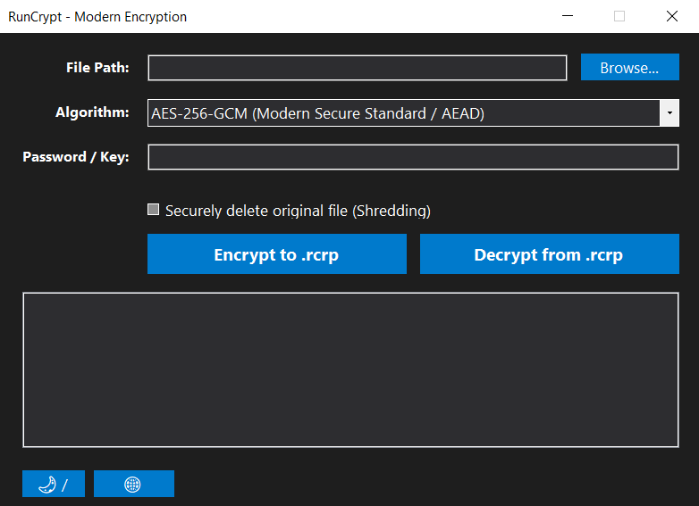
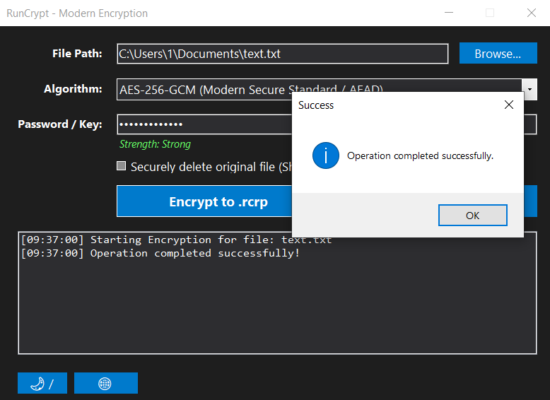

# RunCrypt

Modern file encryption utility for Windows built with C# and .NET.

RunCrypt allows you to encrypt files using modern authenticated encryption algorithms while providing a simple desktop interface, drag & drop support, password strength analysis, secure file deletion, localization, and theme customization.

## Features

* AES-256-GCM encryption
* ChaCha20-Poly1305 encryption
* Authenticated encryption (AEAD)
* Password-based key derivation
* Custom `.rcrp` encrypted container format
* Drag & Drop support
* Password strength indicator
* Secure file deletion
* Dark and Light themes
* Russian and English localization
* Simple and fast Windows UI

## Supported Algorithms

### Secure Algorithms

| Algorithm         | Status      |
| ----------------- | ----------- |
| AES-256-GCM       | Recommended |
| ChaCha20-Poly1305 | Recommended |

### Experimental Algorithms

These algorithms are included for educational and research purposes only and should not be used to protect sensitive information.

* Base64 Containerization
* Byte Inversion (NOT)
* Dynamic XOR Cascade

## Container Format

RunCrypt stores encrypted files inside a custom `.rcrp` container.

Container structure:

* Magic Header
* Algorithm Identifier
* Original Extension
* Salt
* Nonce
* Authentication Tag
* Ciphertext

## Screenshots

Add screenshots here.

### Main Window

### Encryption Process

## Installation

Download the latest release from the Releases page and run:

RunCrypt.exe

No additional configuration required.

## Usage

1. Select a file.
2. Choose an encryption algorithm.
3. Enter a password.
4. Click Encrypt.
5. Save the generated `.rcrp` container.

To decrypt:

1. Select a `.rcrp` file.
2. Enter the correct password.
3. Click Decrypt.

## Security Notes

* AES-256-GCM and ChaCha20-Poly1305 provide authenticated encryption.
* Every encryption operation uses a random salt and nonce.
* Experimental algorithms are not intended for real-world security.
* Always use strong passwords.

## Technologies

* C#
* .NET
* Windows Forms
* AES-GCM
* ChaCha20-Poly1305

## Roadmap

* File integrity verification improvements
* Folder encryption
* Batch processing
* Portable version
* Automatic updates
* Plugin system

## License

MIT License

## Author

Developed by blinchic111 (egorbratenko3-code)
